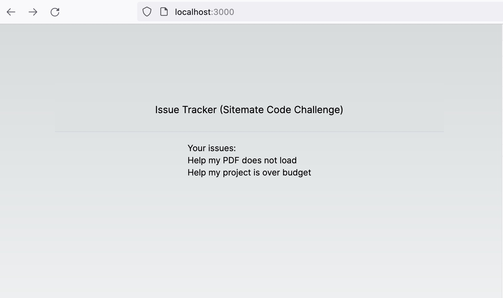

# 👋🏼 Hello Sitemate team

I've built this project with:

- A backend using Typescript/Node using a plain old Express server
- A frontend using NextJS

## Get started

Run the backend server

1. `cd backend`
1. `npm install`
1. `npm run dev`
1. Check that the local API is working: http://localhost:3001/issues

Run the frontend server

1. `cd frontend`
1. `npm install`
1. `npm run dev`
1. Check that the UI is working: http://localhost:3000/

## Future Development

- [] Backend to migrate to NestJS for better structure
- [] Implement unit testing on both BE & FE
- [] Add NPM workspaces
- [] Improve async state management in FE

## Screenshot of the app

